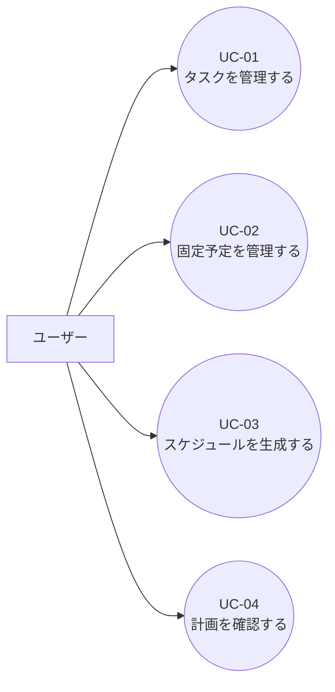
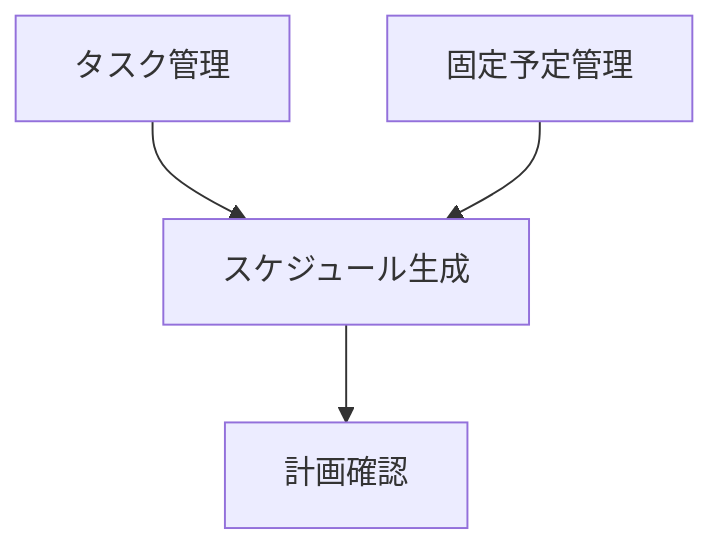

# 要件定義書：ユースケース

## 1. 本書の目的

本書は、本システムにおける主要な利用シーン（ユースケース）を整理し、
「ユーザーが何をしたいのか」「システムが何を提供するのか」を明確にすることを目的とする。

画面設計・API 設計・基本設計の前提資料として利用する。

---

## 2. アクター定義

| アクター | 説明                                                           |
| -------- | -------------------------------------------------------------- |
| ユーザー | 本システムを利用する個人ユーザー（MVP では単一ユーザーを想定） |

※ 管理者・外部システムは MVP では登場しない。

---

## 3. ユースケース一覧

| UC-ID | ユースケース名                 |
| ----- | ------------------------------ |
| UC-01 | タスクを管理する               |
| UC-02 | 固定予定を管理する             |
| UC-03 | その日のスケジュールを生成する |
| UC-04 | 生成された計画を確認する       |

---

## 4. ユースケース図（UC 図）

---

## 5. 各ユースケース詳細

### UC-01：タスクを管理する

#### 概要

ユーザーは、作業タスクや Todo を登録・編集・削除し、
スケジュール生成の入力データとして管理する。

#### 主な操作

- タスクを新規作成する
- タスクを編集する
- タスクを完了/未完了に切り替える
- タスクを一覧・詳細で確認する

#### 補足

- 工数・期限・優先度などは、スケジュール生成時の判断材料となる
- 本 UC 単体ではスケジュール生成は行わない

---

### UC-02：固定予定を管理する

#### 概要

ユーザーは、会議や外出などの「動かせない予定」を登録し、
作業可能な空き時間を正確に算出できるようにする。

#### 主な操作

- 固定予定を登録する
- 固定予定を編集・削除する
- 対象日の固定予定一覧を確認する

#### 補足

- 固定予定はスケジュール生成時に「作業不可時間」として扱われる
- 外部カレンダー連携は MVP 対象外とする

---

### UC-03：その日のスケジュールを生成する

#### 概要

ユーザーは対象日を指定し、その日の空き時間に対して
タスクを自動で割り当てたスケジュール案を生成する。

#### 事前条件

- タスクが 1 件以上登録されている
- 作業可能時間が設定されている（デフォルト可）
- 対象日の固定予定が登録されている（任意）

#### 基本フロー

1. ユーザーが対象日を選択する
2. 作業可能時間・制約パラメータを入力する
3. 「スケジュール生成」を実行する
4. システムが計画（Plan）を生成する
5. 生成結果を保存する

#### 代替フロー

- 空き時間が不足している場合
  - → overflow と warnings を含めて返却する
- LLM が利用できない場合
  - → 説明なしで計画を返却する

---

### UC-04：生成された計画を確認する

#### 概要

ユーザーは生成されたスケジュール案を確認し、
その日の行動計画として参考にする。

#### 主な確認内容

- 時間割（PlanBlocks）
- 休憩・バッファの位置
- 入らなかったタスク（overflow）
- 警告メッセージ（warnings）
- 計画の説明文（LLM 生成）

#### 補足

- MVP では計画は「確認のみ」とし、手動編集は必須としない
- 再生成・ロックは Phase1.5 以降で対応予定

---

## 6. ユースケース間の関係（簡易フロー）

---

## 7. 非対象ユースケース（明示）

以下のユースケースは本 MVP では扱わない。

- 複数ユーザーでの共有・編集
- チーム単位でのスケジュール調整
- 通知・リマインド
- 自動学習による計画改善

---

## 8. 次工程への引き渡し事項

本ユースケース定義を前提として、以下の設計を行う。

- 基本設計：画面遷移図、ER 図
- 詳細設計：API 設計、スケジューリング仕様
- 実装：Task / Event / Plan を中心とした CRUD および生成処理
