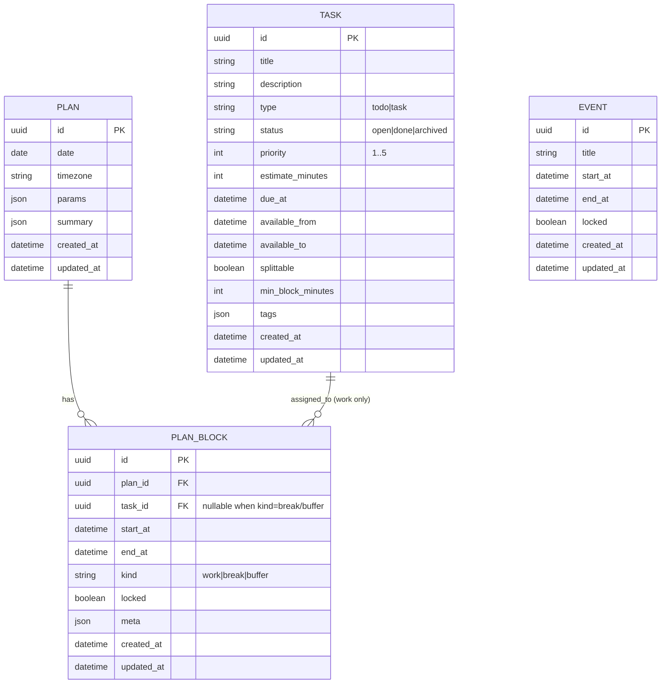

# 基本設計書：ER 図（MVP）

## 1. 本書の目的

本書は、MVP におけるデータベースのエンティティとリレーションを ER 図として示し、
DB 実装（モデル定義・マイグレーション）および API 設計の前提を揃えることを目的とする。

---

## 2. ER 図（Mermaid）

---

## 3. リレーション補足

### 3.1 Plan - PlanBlock（1:N）

- 1 つの Plan は複数の PlanBlock を持つ
- PlanBlock は必ず Plan に属する（plan_id は必須）

### 3.2 Task - PlanBlock（1:N）

- 1 つの Task は複数の PlanBlock に割り当てられ得る
- ただし、割当（task_id が入る）のは kind=work の場合のみ
- break/buffer の PlanBlock は task_id = null を許容する

### 3.3 Event の扱い

- Event は「固定予定」として空き時間算出の入力に使う
- MVP では Plan と直接リレーションしない
- 理由：Plan は「生成結果」であり、Event は「入力データ」であるため
- 生成条件の完全再現が必要な場合は、Plan.params に参照情報を保持する

---

## 4. DB 制約（設計上の前提）

- TASK.available_from と TASK.available_to が両方ある場合、available_from <= available_to
- EVENT.start_at < EVENT.end_at
- PLAN_BLOCK.start_at < PLAN_BLOCK.end_at
- 同一 Plan 内で PlanBlock の時間帯が重複しない（アプリ側で担保）

---

## 5. 次工程への引き渡し

- 本 ER 図を前提に、API 設計（CRUD/生成）で返却する項目を確定する
- SQLAlchemy モデルおよびマイグレーションに落とし込む
