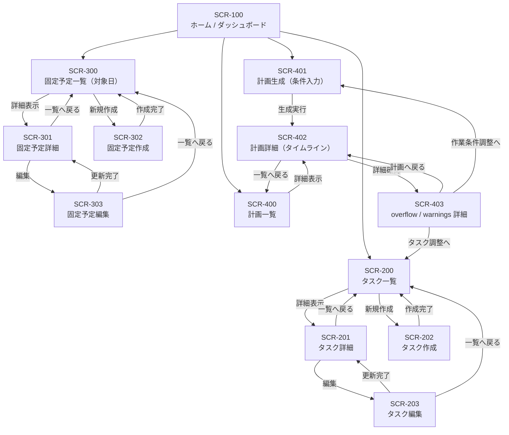

# 基本設計書：画面遷移図（MVP）

## 1. 本書の目的

本書は、MVP で提供する各画面の遷移関係（ユーザー導線）を図示し、
画面一覧（基本設計書：画面一覧）と合わせて UI 実装・API 設計の前提を揃えることを目的とする。

---

## 2. 画面遷移図（Mermaid）

---

## 3. 遷移の補足（設計意図）

### 3.1 計画生成導線（最重要）

- SCR-401（条件入力） で対象日・作業可能時間・制約を指定し、SCR-402 に遷移する
- SCR-402 は計画の主要表示（タイムライン/リスト）を担う
- SCR-403 は overflow / warnings の詳細説明をまとめ、必要に応じて
  - タスクの調整（SCR-200）
  - 作業条件の調整（SCR-401）

へ誘導する

### 3.2 CRUD 導線

- タスク、固定予定は「一覧 → 詳細 → 編集」が基本導線
- 作成は「一覧 → 作成 → 一覧へ戻る」とする
- MVP では「作成後は一覧へ戻る」または「詳細へ遷移」は実装判断に委ねる（本図では一覧へ戻る）

### 3.3 MVP の割り切り

- 計画（Plan）の手動編集（ドラッグ＆ドロップ）は本遷移に含めない
- ブロックロック・再生成は Phase1.5 以降で追加（遷移・画面も追加予定）

---

## 4. 次工程への引き渡し

- 本遷移図を前提に、各画面に必要な API を洗い出し「API 一覧」を作成する
- 画面ごとの入力項目・表示項目は、詳細設計（画面項目定義）で確定する（必要に応じて追加）
