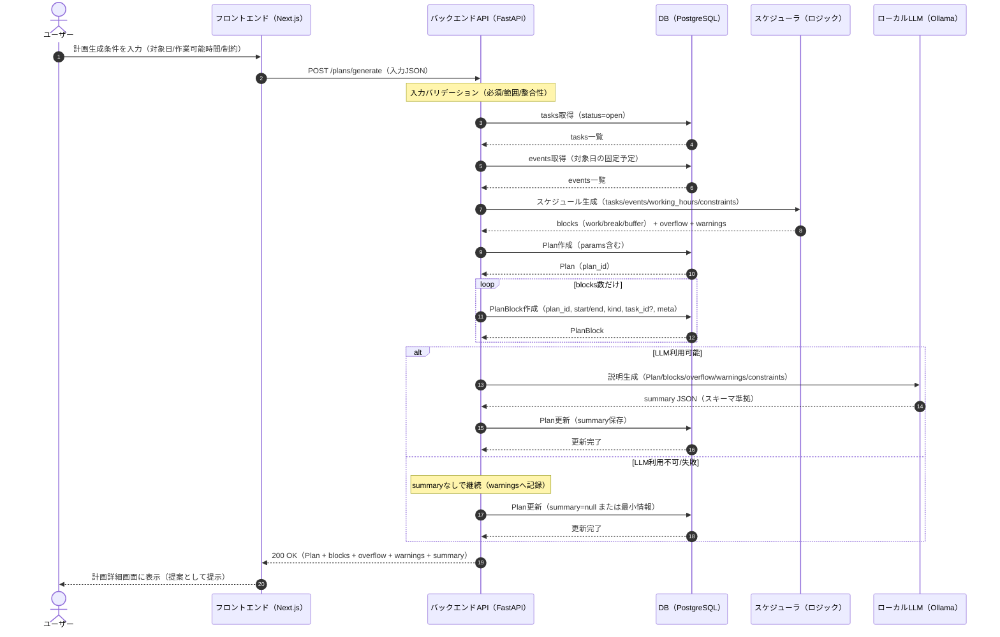

# 基本設計書：主要シーケンス図（計画生成）※MVP

## 1. 本書の目的

本書は、計画生成（POST /plans/generate）における主要処理の流れをシーケンス図で示し、
フロントエンド・バックエンド・DB・スケジューラ・LLM の責務と境界を明確にすることを目的とする。

---

## 2. 対象範囲

- 対象機能：計画生成（UC-03）
- 対象 API：POST /plans/generate
- 出力：Plan / PlanBlock / overflow / warnings / summary（LLM 説明）

---

## 3. 主要シーケンス図（Mermaid）

---

## 4. 例外・分岐（MVP ルール）

### 4.1 空き時間不足

- スケジューラは overflow に未割当タスクを格納する
- warnings に注意喚起を格納する
- 生成処理自体は失敗にしない（200 で返却する）

### 4.2 LLM が利用できない場合

- Plan 生成（DB 保存）までは必ず実施する
- summary 生成に失敗した場合でも計画は返却する
- summary は null または空オブジェクトとして扱う

---

## 5. 主要データの受け渡し（要点）

### 5.1 /plans/generate 入力（要点）

- date（対象日）
- working_hours（例：09:00-12:00, 13:00-18:00）
- constraints（break_minutes, focus_max_minutes, buffer_ratio）

### 5.2 生成結果（要点）

- blocks：PlanBlock 相当の配列（start/end/kind/task_id?）
- overflow：未割当タスクの配列（reason 含む）
- warnings：警告の配列（コードまたは文言）
- summary：LLM 説明（JSON）

---

## 6. 次工程への引き渡し

- 詳細設計（API 設計）で /plans/generate の I/O・バリデーション・エラー仕様を確定する
- 詳細設計（スケジューリング仕様）で SCH の入出力データ構造とルールを確定する
- 実装では、LLM 失敗時も計画返却することをユニットテストで担保する
