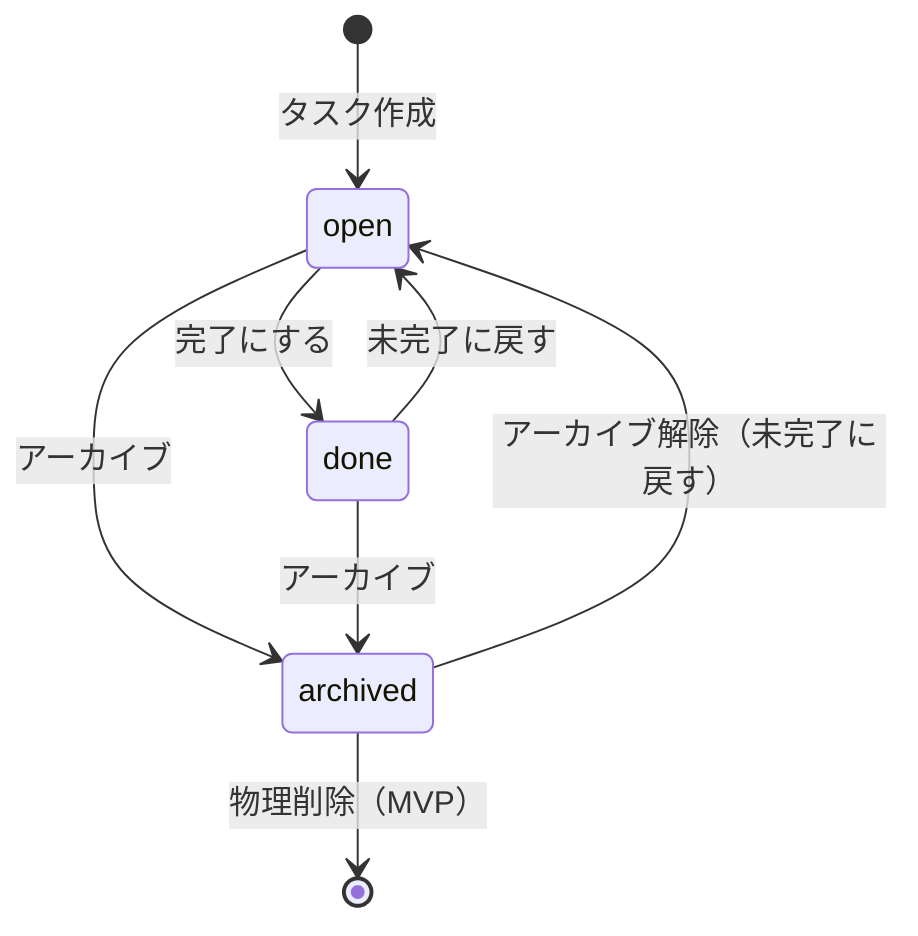
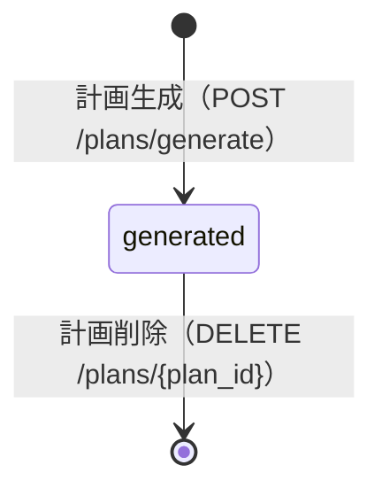

# 基本設計書：状態遷移図（Task / Plan）※MVP

## 1. 本書の目的

本書は、タスク（Task）および計画（Plan）の状態と遷移を定義し、
画面・API・DB 設計の前提を統一することを目的とする。

---

## 2. 対象範囲

- Task：タスク管理（UC-01）
- Plan：計画生成・参照（UC-03 / UC-04）

---

## 3. 状態定義

### 3.1 Task 状態（tasks.status）

| 状態       | コード   | 定義                                                 |
| ---------- | -------- | ---------------------------------------------------- |
| 未完了     | open     | 作業対象としてスケジュール生成に含まれる状態         |
| 完了       | done     | 作業完了としてスケジュール生成対象外の状態           |
| アーカイブ | archived | 非表示・保管目的の状態。スケジュール生成対象外の状態 |

### 3.2 Plan 状態

MVP では plans に状態カラムを持たず、以下の論理状態で扱う。

| 状態   | 定義                          | 判定基準                     |
| ------ | ----------------------------- | ---------------------------- |
| 生成済 | DB に保存され、参照可能な計画 | plans にレコードが存在する   |
| 削除済 | DB から削除された計画         | plans にレコードが存在しない |

---

## 4. 状態遷移図（Mermaid）

### 4.1 Task 状態遷移図

### 4.2 Plan 状態遷移図（論理状態）

---

## 5. 遷移ルール（MVP）

### 5.1 Task 遷移ルール

- open のみがスケジュール生成対象となる
- done は生成対象外とする
- archived は生成対象外とし、通常一覧の表示対象外とする
- アーカイブ解除は open に戻す

### 5.2 Plan 遷移ルール

- 計画生成時は必ず DB に保存する
- 計画削除は物理削除とし、削除後は参照不可とする

---

## 6. 画面・API との対応（要点）

### 6.1 Task

- open -> done：POST /tasks/{task_id}/complete
- done -> open：POST /tasks/{task_id}/reopen
- open/done -> archived：PATCH /tasks/{task_id}（status 更新）
- archived -> open：PATCH /tasks/{task_id}（status 更新）
- archived -> delete：DELETE /tasks/{task_id}

### 6.2 Plan

- [*] -> generated：POST /plans/generate
- generated -> [*]：DELETE /plans/{plan_id}

---

## 7. 次工程への引き渡し

- 詳細設計（API 設計）で status 更新の I/O・バリデーションを確定する
- 詳細設計（DB 設計）で archived の扱い（物理削除との関係）を確定する
- テストでは「open のみ生成対象」を必須観点として担保する
